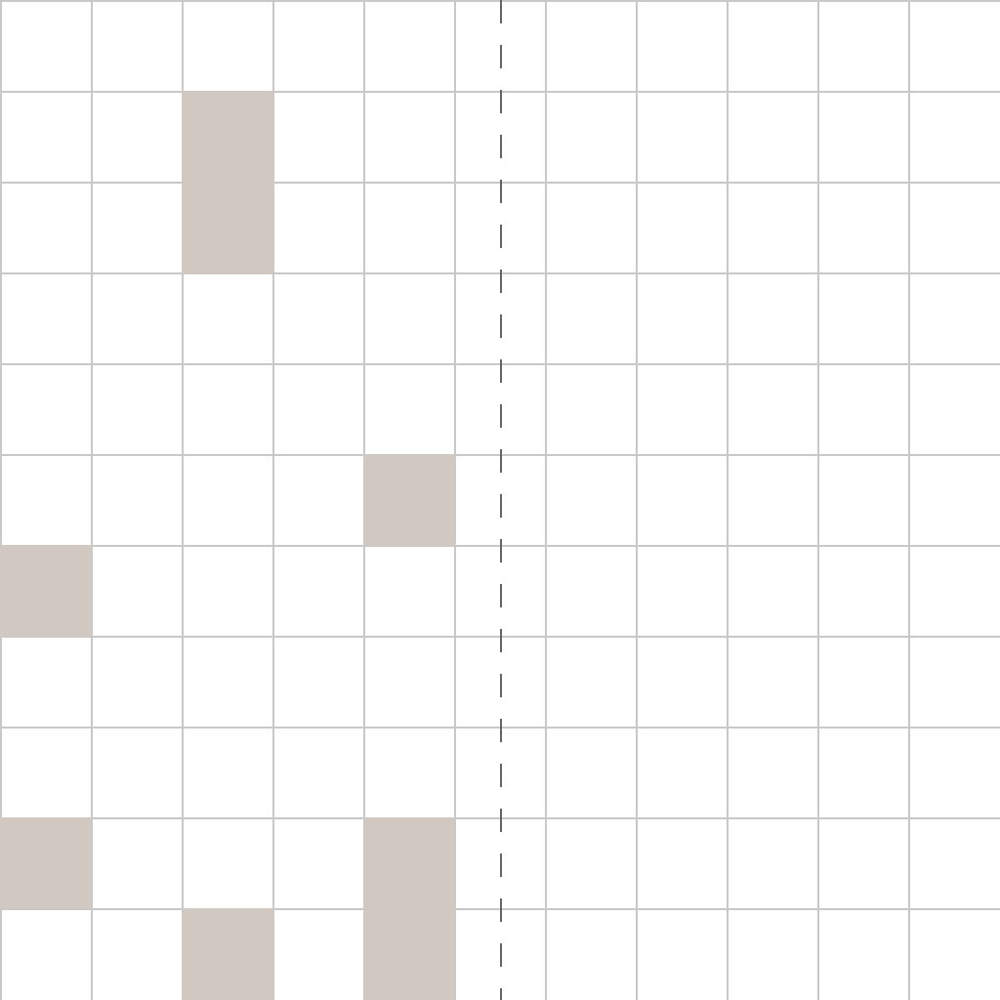
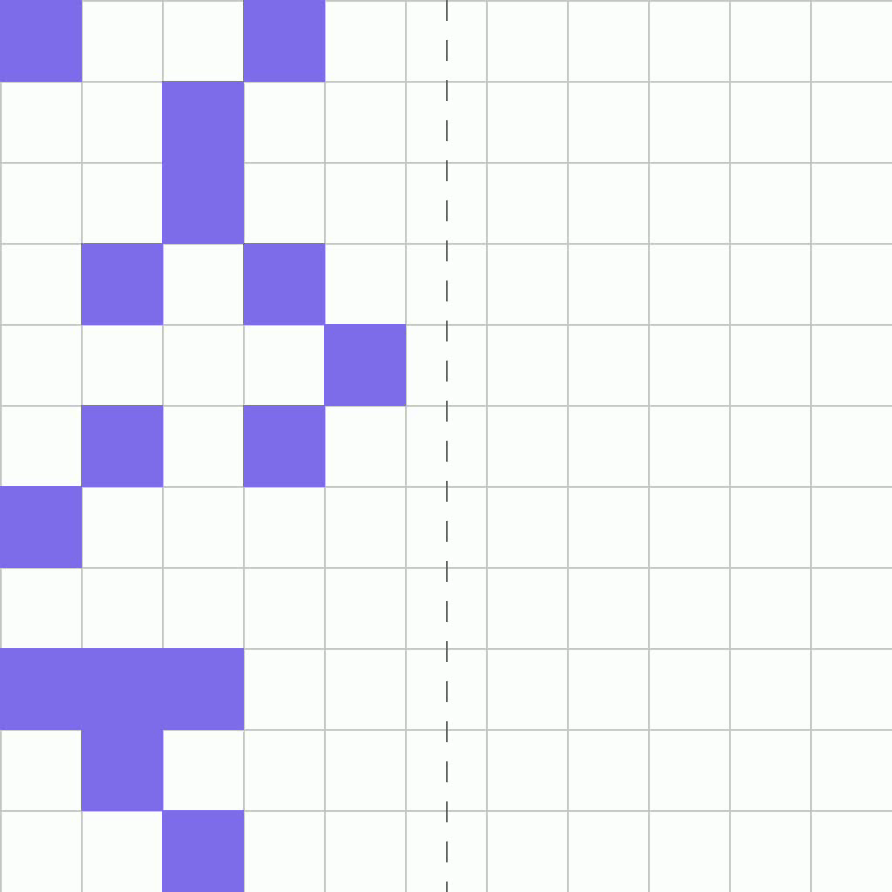
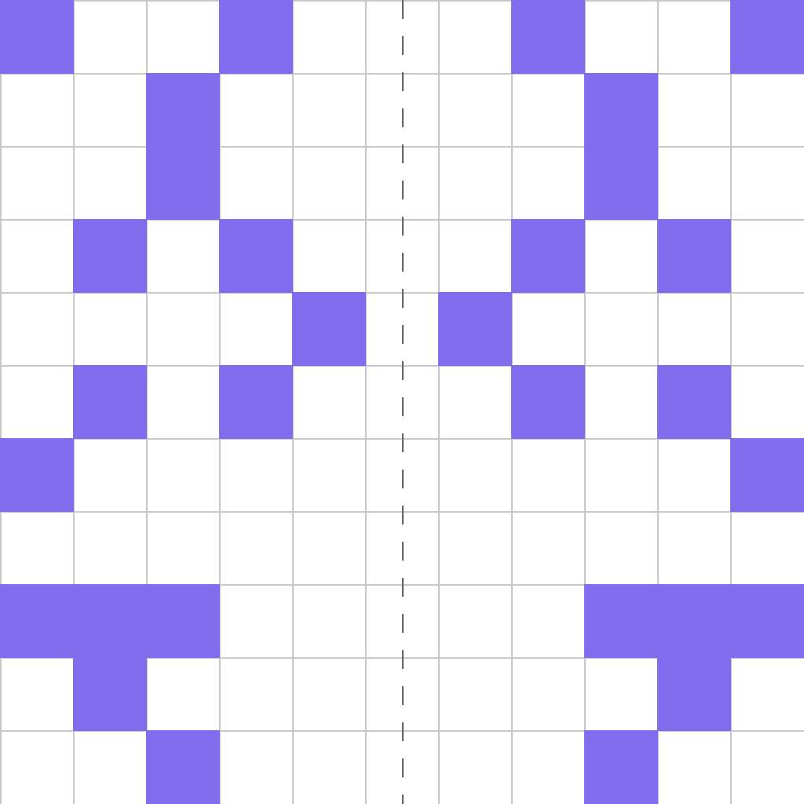

# G-37: Symmetry Random Data Generator

Generates synthetic datasets for training and evaluating vision models on pattern symmetry and mirroring tasks. Each sample contains a random scatter pattern on one half of a grid that must be mirrored symmetrically to the other half.

Each sample pairs a **task** (first frame + prompt describing what needs to happen) with its **ground truth solution** (final frame showing the result + video demonstrating how to achieve it). This structure enables both model evaluation and training.

---

## 📌 Basic Information

| Property | Value |
|----------|-------|
| **Task ID** | G-37 |
| **Task** | Symmetry Random |
| **Category** | Visual Reasoning |
| **Resolution** | 1024×1024 px |
| **FPS** | 16 fps |
| **Duration** | ~3 seconds |
| **Output** | PNG images + MP4 video |

---

## 🚀 Usage

### Installation

```bash
# 1. Clone the repository
git clone https://github.com/VBVR-DataFactory/G-37_symmetry_random_data-generator.git
cd G-37_symmetry_random_data-generator

# 2. Create and activate virtual environment
python3 -m venv venv
source venv/bin/activate  # On Windows: venv\Scripts\activate

# 3. Install dependencies
pip install --upgrade pip
pip install -r requirements.txt
pip install -e .
```

### Generate Data

```bash
# Generate 50 samples
python examples/generate.py --num-samples 50

# Custom output directory
python examples/generate.py --num-samples 100 --output data/my_dataset

# Reproducible generation with seed
python examples/generate.py --num-samples 50 --seed 42

# Without videos (faster)
python examples/generate.py --num-samples 50 --no-videos
```

### Command-Line Options

| Argument | Description |
|----------|-------------|
| `--num-samples` | Number of tasks to generate (required) |
| `--output` | Output directory (default: `data/questions`) |
| `--seed` | Random seed for reproducibility |
| `--no-videos` | Skip video generation (images only) |

---

## 📖 Task Example

### Prompt

```
The scene shows a grid with a random scatter pattern on the left half. Expand the scatter pattern symmetrically to the right half by mirroring it across the vertical axis, creating a complete symmetric pattern.
```
### Visual

<table>
<tr>
  <td align="center"></td>
  <td align="center"></td>
  <td align="center"></td>
</tr>
<tr>
  <td align="center"><b>Initial Frame</b><br/>Random scatter on left half of grid</td>
  <td align="center"><b>Animation</b><br/>Pattern mirrored across vertical axis</td>
  <td align="center"><b>Final Frame</b><br/>Complete symmetric scatter pattern</td>
</tr>
</table>

---

## 📖 Task Description

### Objective
Create a vertically symmetric pattern by mirroring a random scatter from one half of the grid to the other half.

### Task Setup
- **Grid structure**: Regular grid with vertical center axis
- **Initial pattern**: Random scattered elements on left half
- **Symmetry axis**: Vertical center line (left-right mirror)
- **Pattern type**: Disconnected random scatter (not continuous shape)
- **Mirroring direction**: Left to right across vertical axis
- **Background**: White grid with clear axis indication
- **Goal**: Create perfect mirror symmetry across vertical center

### Key Features
- Random scatter pattern (discontinuous elements)
- Vertical axis symmetry (left-right mirroring)
- Pixel-perfect symmetric placement
- Grid-based positioning for precise alignment
- Tests understanding of reflection symmetry
- Multiple scattered elements to mirror

---

## 📦 Data Format

```
data/questions/symmetry_random_task/symmetry_random_00000000/
├── first_frame.png      # Grid with scatter on left half
├── final_frame.png      # Complete symmetric scatter pattern
├── prompt.txt           # Symmetry expansion instruction
├── ground_truth.mp4     # Animation of mirroring process
└── question_metadata.json # Task metadata
```


**File specifications:**
- **Images**: 1024×1024 PNG format
- **Video**: MP4 format, 16 fps
- **Duration**: ~3 seconds

---

## 🏷️ Tags

`visual-reasoning` `symmetry` `mirroring` `pattern-completion` `spatial-reasoning` `reflection`

---
